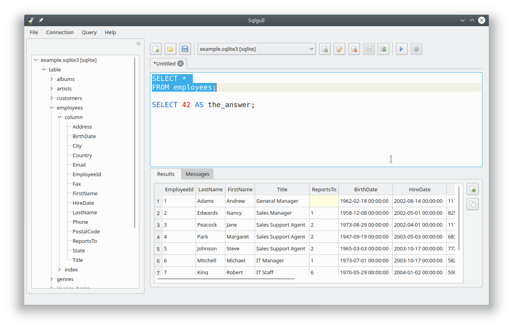

# Sqlgull

A minimalist graphical sql client written in Qt5.

Warning: Sqlgull is currently pre-release, expect to find bugs.

# Screenshot



# Features

- supports SQLite, PostgreSQL, MySQL/MariaDB, Microsoft SQL Server (via ODBC)
- syntax highlighting
- saved connections
- CSV & clipboard export
- database object browser
- schema aware auto complete

# Installing

## Ubuntu 18.04

```
sudo apt install build-essential g++ qt5-default
mkdir build
cd build
qmake ..
make
./sqlgull
```
# Configuration

## Microsoft SQL

You may need to install dependencies for odbc and freetds.

### Ubuntu 18.04 dependencies

```
sudo apt-get install unixodbc unixodbc-dev tdsodbc freetds-dev
```

### Testing SQL Server on Linux (Ubuntu 18.04)

With some work SQL Sever can run on Linux. Be make sure you qualify for the correct license of your choice (TL;DR: you likely can use a developer license for free as long as it is only for non-commercial data on non-production systems).

- install docker (see [guide](https://www.digitalocean.com/community/tutorials/how-to-install-and-use-docker-on-ubuntu-18-04) for instructions).
- get container `docker pull microsoft/mssql-server-linux`
- start server `docker run -e 'ACCEPT_EULA=Y' -e 'SA_PASSWORD=<password>' -p 1433:1433 -d microsoft/mssql-server-linux:2017-CU8`
- run sqlcmd to create database `docker exec -it <container_id> /opt/mssql-tools/bin/sqlcmd -S localhost -U sa -P <password>`  (you can use `docker ps | grep '1433->1433' | cut -d ' ' -f 1` to find the containder_id)
- run any setup statements you want to test with. Use the GO keyword to execute the batch of statements, ctrl+d to quit.
```
CREATE DATABASE db;
GO
USE db;
CREATE TABLE foo (id int);
GO
SELECT * FROM foo;
GO
<ctrl+d>
```
- open sqlgull and perform any testing you wish to do
- when finished you can stop the server with `docker stop <container_id>`

# Recognitions

Forked from [Goat](https://github.com/mispp/goat).

Icons from [Silk](http://www.famfamfam.com/lab/icons/silk/).

